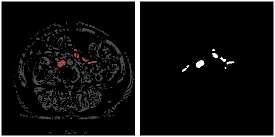
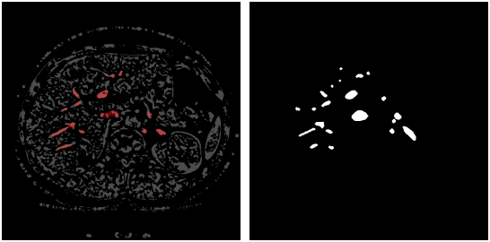
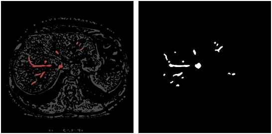

# Vascular-Segmentation
This is my project about liver vessel segmentation in CT images based on the Hessian matrix and U-Net networks

# Datasets
We used the data taken from the 3DIRCADb-01 database of liver segmentation images from IRCAD, France, and the experimental results were compared with those from expert manual segmentation.

# Results

